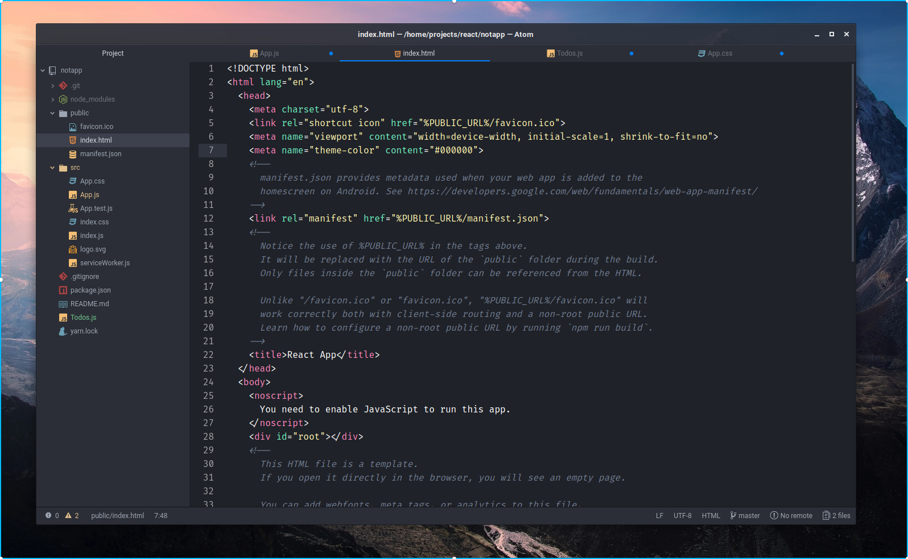

# PLANE-SYNTAX THEME

A beautiful syntax theme for Atom, more information in [Plane project](https://github.com/wfpaisa/plane)

## Install
1. Download in `~/.atom/packages`
2. Open: Settings -> Themes -> choose: Plane

## License

[MIT License](./LICENSE)
